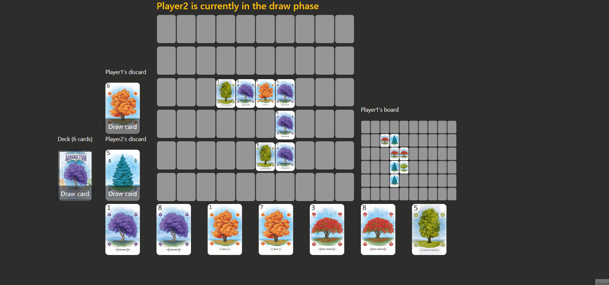

# Arboretum

## About The Project

This is an implementation of the [Arboretum](https://boardgamegeek.com/boardgame/140934/arboretum) boardgame created by [Dan Cassar](http://dancassar.com/)

This implementation is built by me purely for learning purposes and to play with my friends online.

The game currently supports 2-3 players.

### Player turn
Player draws cards (from deck or discard), plays a card, and discards a card.




### End of game scoring
The game determines who scores for what tree type and calculates its top-scoring path. The player with the highest score wins. 
The UI supports mousing over each tree type to see which path was the highest scoring.  


## Built With

* [Python](https://www.python.org/)
* [Flask](https://flask.palletsprojects.com)
* [SocketIO](https://socket.io/)
* [Javascript](https://developer.mozilla.org/fr/docs/Web/JavaScript)
* [CSS](https://developer.mozilla.org/fr/docs/Web/CSS)
* [HTML](https://developer.mozilla.org/fr/docs/Web/HTML)

### Flask Extensions used

* [Flask SocketIO](https://flask-socketio.readthedocs.io)

## Running the game
Environment variables. Can be set in the .env file or in the operating system.

| Variable | Example Value 
| :---:   |:-------------:|
| SECRET_KEY |  "my_secret"  |

## Running the game

Navigate to the same folder as the app.py file and execute:
```
python -m flask run
```

To run in debug
```
python -m flask --debug run
```
